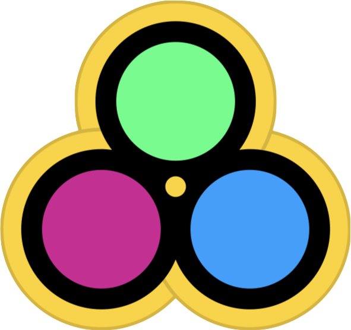

<h3 align="center">

</h3>

# StoryFlow

[](https://github.com/trafi/StoryFlow/blob/master/LICENSE)
[](https://github.com/Carthage/Carthage)

Functional view controllers automatic flow coordination ✨ ([As presented in UIKonf 📺](https://youtu.be/1r7r-mqaSuI))

<table>
    <tr>
        <th>Task</th>
        <th>With StoryFlow 😎</th>
        <th>Without StoryFlow 😱</th>
    </tr>
    <tr>
        <td>Create,</br>Inject,</br>Show</td>
        <td>
            <pre lang="swift">
typealias OutputType = String
&nbsp;
func doTask() {
    self.produce("Input")
}</pre>
        </td>
        <td>
            <pre lang="swift">
func doTask() {
    let nextVc = NextVc()
    nextVc.input = "Input"
    self.show(nextVc, sender: nil)
}</pre>
        </td>
    </tr>
    <tr valign="top">
        <td></td>
        <td>
            😎 completely <i>isolated</i> from other vcs.</br>
            🤓 gained <i>type-safe</i> <a href="#OutputProducing"><code>produce</code> func</a>.</br>
            😝 automatic <i>injection</i> of produced value.<br>
            😚 <a href="#CustomTransition">navigation <i>customizable</i></a> out of vc.</br>
            🥳 easy to <i>test</i> with mocked <code>produce</code>.</br></br>
        </td>
        <td>
            😳 knows the <i>type</i> of next vc.</br>
            😡 knows the <i>property</i> of next vc to inject.</br>
            😢 knows how to <i>navigate</i> to next vc.</br>
            🤯 easy to <i>break</i>, hard to test.</br></br>
        </td>
    </tr>
    <tr>
        <td>Update,</br>Unwind</td>
        <td>
            <pre lang="swift">
typealias OutputType = String
&nbsp;
func doTask() {
    self.produce("Update")
}</pre>
        </td>
        <td>
            <pre lang="swift">
func doTask() {
    let prevVc = self.presenting as! PrevVc
    prevVc.handle("Update")
    self.dismiss(animated: true)
}</pre>
        </td>
    </tr>
    <tr valign="top">
        <td></td>
        <td>
            😎 completely <i>isolated</i> from other vcs.</br>
            🤓 gained <i>type-safe</i> <a href="#OutputProducing"><code>produce</code> func</a>.</br>
            😝 automatic <i>update</i> with produced value.<br>
            😚 <a href="#CustomTransition">navigation <i>customizable</i></a> out of vc.</br>
            🥳 easy to <i>test</i> with mocked <code>produce</code>.</br></br>
        </td>
        <td>
            🤬 knows the <i>place in nav stack</i> of prev vc.</br>
            😳 knows the <i>type</i> of prev vc.</br>
            🥵 knows the <i>method</i> of prev vc for update.</br>
            😭 knows how to <i>unwind</i> to prev vc.</br>
            🤯 easy to <i>break</i>, hard to test.</br></br>
        </td>
    </tr>
    <tr>
        <td>Update,</br>Difficult</br>unwind</td>
        <td>
            <pre lang="swift">
typealias OutputType = Int
&nbsp;
func doTask() {
    self.produce(42)
}</pre>
        </td>
        <td>
            <pre lang="swift">
func doTask() {
    let nav = self.presenting as! NavC
    let prevVc = nav.vcs[2] as! PrevVc
    &nbsp;
    prevVc.handle(42)
    &nbsp;
    self.dismiss(animated: true)
    nav.popTo(preVc, animated: false)
}</pre>
        </td>
    </tr>
    <tr valign="top">
        <td></td>
        <td align="center">😎</td>
        <td align="center">😱😳😭🥵🤬🤯</td>
    </tr>
</table>

# Usage

StoryFlow **isolates** your view controllers from each other and **connects** them in a navigation flow using three simple generic protocols - [`InputRequiring`](#InputRequiring), [`OutputProducing`](#OutputProducing) and [`UpdateHandling`](#UpdateHandling). You can **customize** navigation transition styles using [`CustomTransition`](#CustomTransition) and routing using [`OutputTransform`](#OutputTransform).

## `InputRequiring`

```swift
protocol InputRequiring {
    associatedtype InputType
}
extension InputRequiring {
    var input: InputType { return ✨ } // Returns 'output' of previous vc
}
```
TODO

## `OutputProducing`

```swift
protocol OuputProducing {
    associatedtype OutputType
}
extension OuputProducing {
    func produce(_ output: OutputType) { ✨ } // Opens vc with matching `UpdateType` or `InputType`
}

typealias IO = InputRequiring & OutputProducing // For convenience
```
TODO

## `UpdateHandling`

```swift
protocol UpdateHandling {
    associatedtype UpdateType
    func handle(update: UpdateType) // Gets called with 'output' of dismissed vc
}

typealias IOU = InputRequiring & OutputProducing & UpdateHandling // For convenience
```
TODO

## `CustomTransition`

TODO

## `OutputTransform`

TODO

# Installation

[Using Carthage](https://github.com/Carthage/Carthage#adding-frameworks-to-an-application) - just add the following line to your `Cartfile`:
```
github "Trafi/StoryFlow"
```

